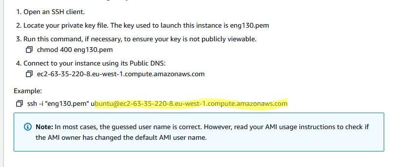

## Connecting our app folder to website

first thing we need to learn is to upload a file from our local to our AWS VM.
```
scp -i access.pem -r /c/user/Documents/directory1 ubuntu@0.0.0.0:/home/ubuntu/
```
where `ubuntu@0.0.0.0:` is your unique address to your own VM as shown below with yellow highlight.



This is also the method you use to ssh to your virtual machine in AWS.<br/>
Another possibility is to upload work into github and use the normal function `git` to clone the repository, which is much simpler and faster too. <br/>

## Get the app working

1. need to install all requirements. nodejs and pm2, we can use my past repository for this <a href="https://github.com/Jorge2091/eng130_virtualisation#vagrant-installations-inside-virtual-box"> HERE</a>
2. install nginx and have reverse proxy to link to port 3000 by going into the default file, this is also shown in the link above.
3. create env Variable, this can be done by going to `sudo nano ~/. bashrc`.
4. npm start inside where the app.js is, and website will be working.

## connection to mongodb
This is also known as a 2 tier architecture, when we use two devices, one for database, and one for the server.

1. create the ec2 instance, the same as of the app
2. we need to download the mongodb database
```bash
sudo apt-key adv --keyserver hkp://keyserver.ubuntu.com:80 --recv D68FA50FEA312927

echo "deb https://repo.mongodb.org/apt/ubuntu xenial/mongodb-org/3.2 multiverse" | sudo tee /etc/apt/sources.list.d/mongodb-org-3.2.list

sudo apt-get update -y
sudo apt-get upgrade -y

sudo apt-get install -y mongodb-org=3.2.20 mongodb-org-server=3.2.20 mongodb-org-shell=3.2.20 mongodb-org-mongos=3.2.20 mongodb-org-tools=3.2.20
```
3. we can now check status `systemctl status mongod`